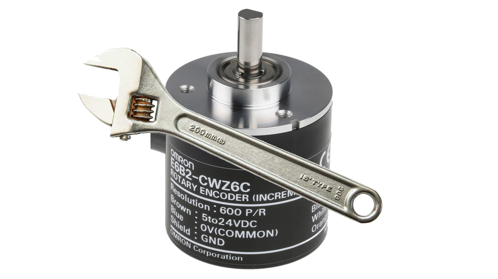

<!-- Improved compatibility of back to top link: See: https://github.com/othneildrew/Best-README-Template/pull/73 -->
<a name="readme-top"></a>
<!--
*** Thanks for checking out the Best-README-Template. If you have a suggestion
*** that would make this better, please fork the repo and create a pull request
*** or simply open an issue with the tag "enhancement".
*** Don't forget to give the project a star!
*** Thanks again! Now go create something AMAZING! :D
-->


<!-- PROJECT SHIELDS -->
<!--
*** I'm using markdown "reference style" links for readability.
*** Reference links are enclosed in brackets [ ] instead of parentheses ( ).
*** See the bottom of this document for the declaration of the reference variables
*** for contributors-url, forks-url, etc. This is an optional, concise syntax you may use.
*** https://www.markdownguide.org/basic-syntax/#reference-style-links
-->
[![Contributors][contributors-shield]][contributors-url]
[![Forks][forks-shield]][forks-url]
[![Stargazers][stars-shield]][stars-url]
[![Issues][issues-shield]][issues-url]
[![MIT License][license-shield]][license-url]
[![LinkedIn][linkedin-shield]][linkedin-url]


<!-- PROJECT LOGO -->
<br />
<div align="center">
  <a href="https://github.com/andrefdre/Encoder-Tester">
    
  </a>

<h3 align="center">Encoder Tester</h3>

  <p align="center">
    Tester for six channels Encoder with pulses and full rotations as well as channels plotter
    <br />
    <a href="https://github.com/andrefdre/Encoder-Tester"><strong>Explore the docs »</strong></a>
    <br />
    <br />
    <a href="https://github.com/andrefdre/Encoder-Tester">View Demo</a>
    ·
    <a href="https://github.com/andrefdre/Encoder-Tester/issues">Report Bug</a>
    ·
    <a href="https://github.com/andrefdre/Encoder-Tester/issues">Request Feature</a>
  </p>
</div>


<!-- TABLE OF CONTENTS -->
<details>
  <summary>Table of Contents</summary>
  <ol>
    <li>
      <a href="#about-the-project">About The Project</a>
      <ul>
        <li><a href="#built-with">Built With</a></li>
      </ul>
    </li>
    <li>
      <a href="#getting-started">Getting Started</a>
      <ul>
        <li><a href="#prerequisites">Prerequisites</a></li>
        <li><a href="#installation">Installation</a></li>
      </ul>
    </li>
    <li><a href="#usage">Usage</a></li>
    <li><a href="#contributing">Contributing</a></li>
    <li><a href="#license">License</a></li>
    <li><a href="#contact">Contact</a></li>
  </ol>
</details>


<!-- ABOUT THE PROJECT -->
## About The Project

[![Product Name Screen Shot][product-screenshot]](https://example.com)

Encoders are helpful devices to implement in all kinds of machines that move and need precision. For example, all CNCs (Computerized Numerical Control) machines that require precision in the order of microns, autonomous vehicles and robots. To achieve such accuracy, the motors used are usually servomotors that use an encoder to perceive their global position. While the encoders are of great benefit they require maintenance, since they work in a harsh environment with a lot of electrical noise, making it cumbersome to verify their work with tools such as an oscilloscope.

With this in mind, a new prototype for testing optical encoders was developed consisting of a microprocessor that will capture the signals and display this information on an LCD (Liquid Crystal Display). While displaying captured information, it also saves it into an SD (Secure Digital) card and shows it using LEDs (light-emitting diode) with the help of an I/O (Input/Output) extender for future use in testing also the movement of motors. 

<p align="right">(<a href="#readme-top">back to top</a>)</p>


### Built With

 [![Arduino][arduino-svg]][arduino-url] - Arduino IDE

<p align="right">(<a href="#readme-top">back to top</a>)</p>


<!-- GETTING STARTED -->
## Getting Started

To replicate first wire the components following the wiring diagram presented in the docs folder.

### Prerequisites

Required components:
  - Esp32
  - LCD \verb|nx4827t043_011|
  - Comparator lm339
  - Expander Module I/O pcf8574
  - MH-SD Card Module
  - Any Encoder
  - LED

### Installation

1. Clone the repo
   ```sh
   git clone https://github.com/andrefdre/Encoder-Tester.git
   ```
3. Upload the code to the ESP32


<p align="right">(<a href="#readme-top">back to top</a>)</p>


<!-- USAGE EXAMPLES -->
## Usage

Before using the tool, plug an SD card into its appropriate place, followed by connecting the encoder in question to the tool. After plugging the tool into the computer, it displays all the information to verify the proper working order of the encoder. It is also possible to connect an H-bridge motor control to the equipment using the I/O expander to test a motor moving when the encoder moves. In the end, it is also possible to read all the encoder inputs by opening the text file inside the SD card, allowing the plot of graphs with previously recorded data.

_For more examples, please refer to the [Documentation](https://github.com/andrefdre/Encoder-Tester/blob/main/docs/Documentation.pdf)_

<p align="right">(<a href="#readme-top">back to top</a>)</p>


<!-- CONTRIBUTING -->
## Contributing

If you have a suggestion that would make this better, please fork the repo and create a pull request. You can also simply open an issue with the tag "enhancement".
Don't forget to give the project a star! Thanks again!

1. Fork the Project
2. Create your Feature Branch (`git checkout -b feature/AmazingFeature`)
3. Commit your Changes (`git commit -m 'Add some AmazingFeature'`)
4. Push to the Branch (`git push origin feature/AmazingFeature`)
5. Open a Pull Request

<p align="right">(<a href="#readme-top">back to top</a>)</p>


<!-- LICENSE -->
## License

Distributed under the MIT License. See `LICENSE.txt` for more information.

<p align="right">(<a href="#readme-top">back to top</a>)</p>


<!-- CONTACT -->
## Contact

André Cardoso - [linkedin](https://www.linkedin.com/in/andr%C3%A9-cardoso-8bb264223/)  - andref@ua.pt

Project Link: [https://github.com/andrefdre/Encoder-Tester](https://github.com/andrefdre/Encoder-Tester)

<p align="right">(<a href="#readme-top">back to top</a>)</p>


<!-- MARKDOWN LINKS & IMAGES -->
<!-- https://www.markdownguide.org/basic-syntax/#reference-style-links -->
[contributors-shield]: https://img.shields.io/github/contributors/andrefdre/Encoder-Tester.svg?style=for-the-badge
[contributors-url]: https://github.com/andrefdre/Encoder-Tester/graphs/contributors
[forks-shield]: https://img.shields.io/github/forks/andrefdre/Encoder-Tester.svg?style=for-the-badge
[forks-url]: https://github.com/andrefdre/Encoder-Tester/network/members
[stars-shield]: https://img.shields.io/github/stars/andrefdre/Encoder-Tester.svg?style=for-the-badge
[stars-url]: https://github.com/andrefdre/Encoder-Tester/stargazers
[issues-shield]: https://img.shields.io/github/issues/andrefdre/Encoder-Tester.svg?style=for-the-badge
[issues-url]: https://github.com/andrefdre/Encoder-Tester/issues
[license-shield]: https://img.shields.io/github/license/andrefdre/Encoder-Tester.svg?style=for-the-badge
[license-url]: https://github.com/andrefdre/Encoder-Tester/blob/master/LICENSE.txt
[linkedin-shield]: https://img.shields.io/badge/-LinkedIn-black.svg?style=for-the-badge&logo=linkedin&colorB=555
[linkedin-url]: https://www.linkedin.com/in/andr%C3%A9-cardoso-8bb264223/
[product-screenshot]: images/logo.svg
[arduino-svg]: images/arduino.svg
[arduino-url]: https://www.arduino.cc/
